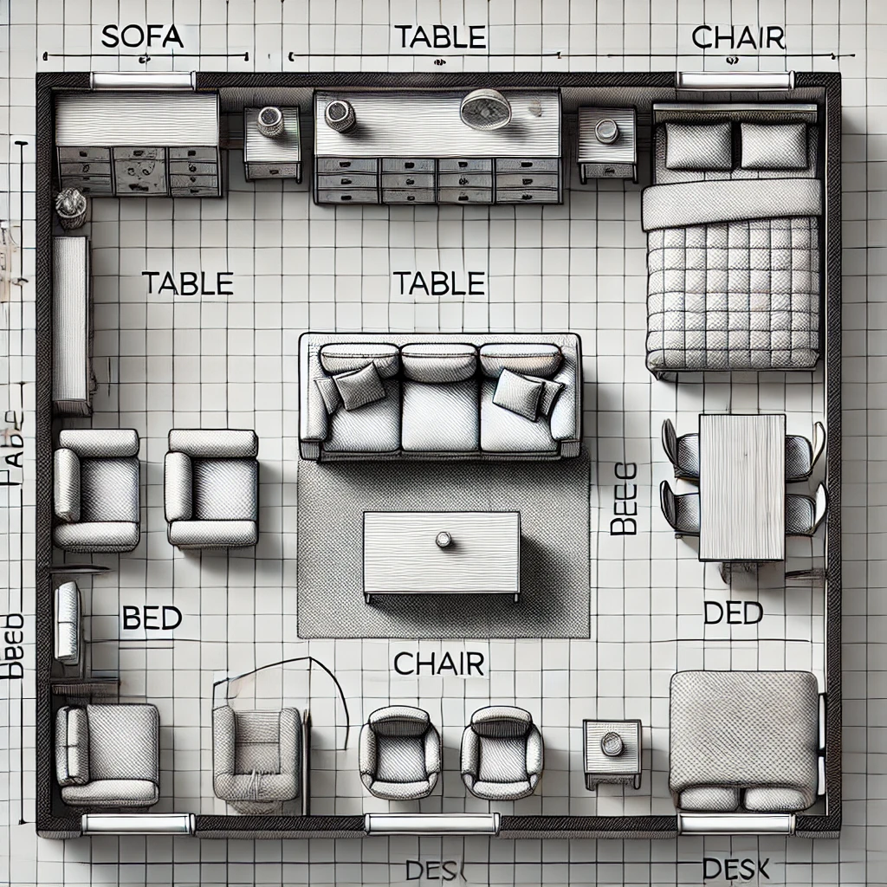
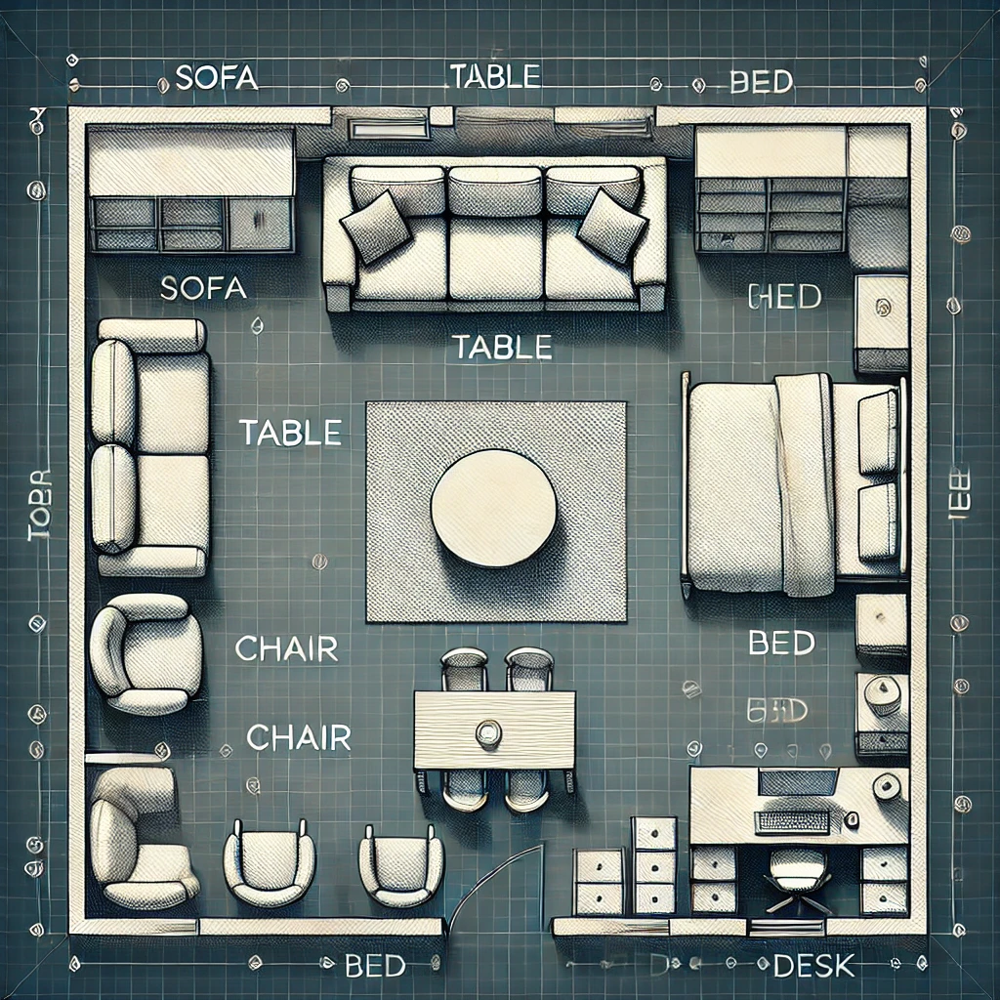

# AI-Driven Furniture Layout Tool

## Overview
This project demonstrates an AI-driven tool to generate optimal furniture layouts in a given room. The tool uses a trained neural network to predict the best positions for various furniture items such as sofas, tables, chairs, beds, and desks.

## Project Structure
- `data/`: Contains raw and processed data.
  - `raw/`: Raw data files.
  - `processed/`: Processed data files.
- `models/`: Trained models.
- `notebooks/`: Jupyter notebooks for data analysis.
- `scripts/`: Python scripts for data generation, model training, and layout generation.
- `images/`: Example images and plots.
- `reports/`: Final reports in PDF and PPTX formats.
- `README.md`: Project documentation.
- `requirements.txt`: Python dependencies.
- `.gitignore`: Files and directories to ignore in Git.

## Getting Started
1. Clone the repository:
    ```sh
    git clone https://github.com/busrakarazeybek/furniture-layout-ai.git
    cd furniture-layout-ai
    ```
2. Install the required dependencies:
    ```sh
    pip install -r requirements.txt
    ```

## Usage
1. Generate training data:
    ```sh
    python scripts/generate_training_data.py
    ```
2. Train the model:
    ```sh
    python scripts/train_model.py
    ```
3. Generate and plot furniture layout using the trained model:
    ```sh
    python scripts/furniture_layout_ai.py
    ```

## Example Visualization
Here is an example of an AI-generated furniture layout:



## Requirements
- Python 3.x
- TensorFlow
- NumPy
- Matplotlib
- Pandas

## Project Details
- `generate_training_data.py`: Script to generate random training data.
- `train_model.py`: Script to train the neural network model.
- `furniture_layout_ai.py`: Script to generate furniture layout using the trained model.
- `plot_utils.py`: Utility functions for plotting layouts.

## Contributing
Feel free to submit pull requests. For major changes, please open an issue first.

